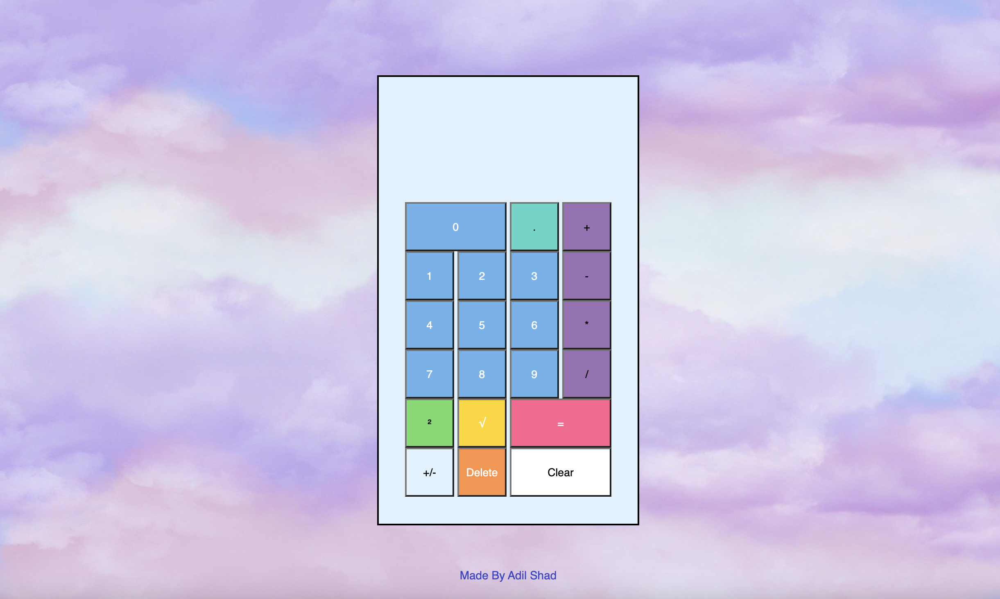

# onScreenCalculator
Make an on-screen calculator using JavaScript, HTML, and CSS

# Motivation 
The motivation behind this project is to build an onscreen calculator using HTML, CSS, and JavaScript. The goal is to learn web development concepts and improve programming skills by creating a practical application.

By working on this project, we aim to:

- Gain hands-on experience with HTML, CSS, and JavaScript.
- Understand the basics of building user interfaces for web applications.
- Learn how to handle user input and implement interactive features.
- Practice problem-solving and logical thinking while developing the calculator's functionality.
- Enhance our understanding of fundamental math operations such as addition, subtraction, multiplication, and division.

This project will not only provide a platform to learn and apply web development concepts but also serve as a stepping stone for future projects and learning endeavors. We hope to gain valuable insights and improve our skills throughout the development process.

We invite everyone interested in web development or looking to build their own calculator to join us in this project. Let's learn and grow together!

# Build Status

This project is complete. 

# Code Style
In this project, I will adhere to the following coding conventions and style guidelines:

- Follow the [JavaScript Standard Style](https://standardjs.com/) for writing JavaScript code.
- HTML and CSS code should be properly indented and organized for readability.
- Descriptive variable and function names are preferred to enhance code understanding.
- Use meaningful comments to explain complex logic or important code sections.
- File and folder naming should be clear and concise.
- Variables and functions names should preferly be descriptive and meaningful. This helps enhance code understanding and makes it easier to maintain and debug.
- Comments use is encouraged: to explain complex logic, document important code sections, and provide additional context where necessary. Clear and concise comments help other developers understand the code more easily.
- Follow best practices for version control using Git. This includes committing changes frequently with meaningful commit messages, branching and merging strategies, and proper handling of code conflicts.
- By adhering to these coding conventions and style guidelines, I aim to enhance the maintainability, readability, and collaboration of the codebase. I request all contributors to follow these guidelines when working on the project, ensuring a consistent and high-quality codebase.
- Feel free to customize and adapt this code style section based on your project's specific needs and requirements.

# Screenshots

# Tech/Framework used

- JavaScript
- HTML
- CSS
- Node.js
- Jest

# Features

- Basic arithmetic operations: Addition, subtraction, multiplication, and division.
- Squared and square-root features. 
- Positive Negative Toggle Button.
- Clear button: Allows the user to clear the input and start fresh.
- Backspace button: Allows the user to delete the last entered character.
- Decimal point: Enables decimal number input for more precise calculations.
- Keyboard support: The calculator can be operated using keyboard input in addition to on-screen buttons.
- Error handling: Displays a friendly message when the user tries to divide by zero.
- Responsive design: The calculator is designed to be visually appealing and responsive across different devices and screen sizes.

These are the core features that I plan to implement in our calculator project. I may expand the functionality further based on the project's progress and requirements. Feel free to suggest any additional features that you think would enhance the calculator's usability.

# Code Examples

1. function addNumbers(a, b) {
  return a + b;
}

const result = addNumbers(5, 3);
console.log(result); // Output: 8

2. <button class="styled-button">Click me</button>

.styled-button {
  background-color: #ff6090;
  color: white;
  padding: 10px 20px;
  border-radius: 4px;
  font-weight: bold;
}

# Installation
To run this calculator project locally, follow these steps:

1. Fork this repository by clicking the "Fork" button at the top right corner of the repository page. This will create a copy of the repository under your GitHub account.

2. Make sure you have [Node.js](https://nodejs.org) installed on your machine.

3. Clone the forked repository to your local machine using the following command: 

git clone https://github.com/your-username/onScreenCalculator.git

Replace `your-username` with your GitHub username.

4. Navigate to the project directory: cd onScreenCalculator

5. Install the project dependencies by running the following command: npm install

   This will install the necessary packages, including Jest for testing.

6. Once the installation is complete, you can run the calculator project by executing: npm start
This will start a local development server, and you can access the calculator in your web browser at [http://localhost:3000](http://localhost:3000).

# Tests

Prior to running tests, event listener functions should be 'noted out'. 

To run the tests for the calculator project, you can use the following command: npm test.

This will execute the test suite using Jest.

Feel free to modify the installation instructions based on your specific setup or any additional requirements you might have for your calculator project.

# How to Use? 
Access the application in your web browser:

Open your browser and navigate to https://adilshads.github.io/onScreenCalculator/

Use user interface to interact with the application.

OR 

For Keyboard use the following: 

- Use the number keys (0-9) on your keyboard to input numerical values.

- Press the decimal point (.) key on your keyboard to enter a decimal number.

- Use the following keys for basic arithmetic operations:

  Addition (+): Press the '+' key.
  Subtraction (-): Press the '-' key.
  Multiplication (): Press the '' key.
  Division (/): Press the '/' key.
  To perform calculations, press the '=' key or the 'Enter' key on your keyboard.

  To clear the display, press the 'Esc' key on your keyboard.

  To toggle the sign of a number (positive/negative), press the 'n' key on your keyboard.

  For advanced operations, use the following keys:

  Square (^): Press the '²' key.
  Square Root (√): Press the 'r' key.
  If you make a mistake, use the 'Backspace' key on your keyboard to delete the last entered digit.

# Credits

Image Credit: [Vicki Hamilton](https://pixabay.com/users/flutie8211-17475707/)

  